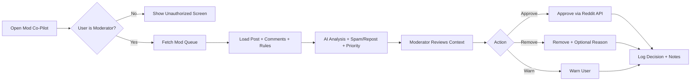
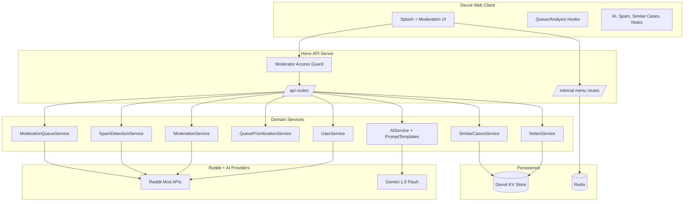

> This repository is public for judging and review, but the deployed Reddit app is intentionally moderator-only at runtime. Judges can review the code, architecture, and demo video even if they are not subreddit moderators.

# Reddit Mod Co-Pilot

Reddit Mod Co-Pilot is an AI-assisted moderation workspace that helps subreddit moderators process queue items faster while keeping every final decision human-led. *Built with Devvit, React, TypeScript, and Gemini for the Reddit Mod Tools & Migrated Apps Hackathon 2026.*.

> Created by [PiyerX](https://github.com/piyerx) & [Paxyz](https://github.com/paxyz-4)


## ■ Problem

Moderators often lose time switching between queue details, comments, user context, rule checks, and action logging. This creates slower response times and inconsistent moderation outcomes.

## ■ Solution

- Pull real queue items from Reddit moderation surfaces.
- Summarize each post and highlight likely rule risks.
- Add safety signals (spam, repost, urgency, similar historical removals).
- Execute actions (approve, remove, warn) and log decisions in one place.

## ■ Key Features

- AI analysis with confidence scoring and suggested action.
- Rule-aware removal reason generation.
- Spam and repost heuristics with clear reason tags.
- Priority scoring to bubble urgent items first.
- Similar-cases lookup to improve consistency.
- Notes and moderation decision timeline per post.
- Moderator-only access guard and dedicated unauthorized screen.

## ■ End-to-End Flow



## ■ Architecture (GitHub Mermaid)



## ■ Technical Snapshot

- Frontend: React 19 + TypeScript, Devvit web client runtime.
- Backend: Hono route layer on `@devvit/web/server`.
- AI: Gemini 1.5 Flash with fallback behavior for resiliency.
- Data: Devvit KV Store (`notes:${postId}`, `decisions:${postId}`), Redis for dashboard post reference.
- Safety: Heuristic spam/repost scoring and consistency via similar-case retrieval.

## ■ Repository Structure

```text
Reddit-Copilot/
├── README.md
├── docs/
│   ├── devlog.md
│   └── projectDetails.md
├── app/
│   ├── package.json
│   ├── public/
│   │   ├── modcop_icon_xl.png
│   │   └── snoo_lock.png
│   └── src/
│       ├── client/
│       │   ├── game.tsx
│       │   ├── splash.tsx
│       │   ├── hooks/
│       │   │   └── useQueue.ts
│       │   └── components/
│       │       ├── UnauthorizedScreen.tsx
│       │       ├── AISummary.tsx
│       │       ├── SpamIndicators.tsx
│       │       └── SimilarCases.tsx
│       ├── server/
│       │   ├── index.ts
│       │   ├── routes/
│       │   │   ├── api.ts
│       │   │   └── menu.ts
│       │   └── services/
│       │       ├── access.ts
│       │       ├── ai.ts
│       │       ├── moderation-queue.ts
│       │       ├── spam-detection.ts
│       │       └── similar-cases.ts
│       └── shared/
│           └── api.ts
└── prompts/
```

## ■ API Highlights

- `GET /api/modqueue` fetches queue items with optional testing and verbose modes.
- `GET /api/queue-item/:postId` fetches a post with top comments.
- `POST /api/analyze` returns AI summary, rule risks, confidence, and suggested action.
- `POST /api/actions/approve|remove|warn` executes moderation actions.
- `POST /api/spam-check`, `POST /api/similar-cases`, and `GET /api/priority-queue` add safety and consistency context.

## 🔴 Submission Note

- This repository is public for judging and review, but the deployed Reddit app is intentionally moderator-only at runtime. Judges can review the code, architecture, and demo video even if they are not subreddit moderators.
- Current hackathon deployment uses a shared Gemini backend key with caching and rate-limit reduction. Production scaling would support configurable model routing and tenant-specific API configuration.

## ■ Team

* **PiyerX** - Core Development, Devvit Architecture, AI Integration, Backend Systems
* **Paxyz** - Research, UX Design, Testing, Moderation Workflow Design


---
<br>
<p align = "center">
Built with 🖤 for Reddit Mod Tools & Migrated Apps Hackathon 2026.
</p>